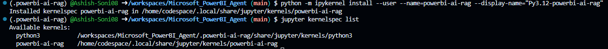

# Hack Together: RAG Hack

Hackathon Organizer - [Microsoft](https://techcommunity.microsoft.com/t5/educator-developer-blog/raghack-free-global-hackathon-sept-3rd-13th-2024/ba-p/4217191)


## Setting up the Environment

```bash
python --version 
# Output -> Python 3.12.1
```

```bash
# create a environment named -> .powerbi-ai-agent
python -m venv .powerbi-ai-rag
```

```bash
# activate the environment
source .powerbi-ai-rag/bin/activate
```

```bash
# Install packages to create a Jupyter Notebook kernel
pip install jupyter ipykernel
```

```bash
# add your virtual environment as a kernel
python -m ipykernel install --user --name=powerbi-ai-rag --display-name="Py3.12-powerbi-ai-rag"
```

```bash
# verify kernel installation
jupyter kernelspec list
```



## Data Collection

In this section, we will discuss how the data was gathered and the sources from which it was obtained.

[PowerBI](https://learn.microsoft.com/en-us/power-bi/)
